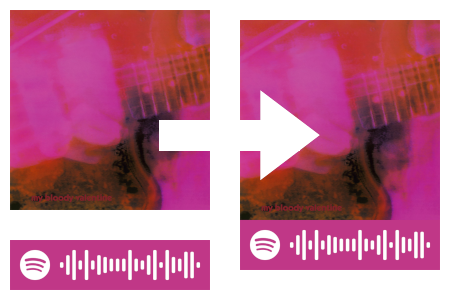

[](https://codecov.io/gh/tilschuenemann/spotifycodegen)

# spotify codegen



Spotify removed the feature to get a stitched image of an album / artist / track cover with their own [Spotify Code](https://www.spotifycodes.com/). This
package mimicks that behaviour and creates stitches, based on supplied

- URL
- URI
- query

It's also possible to use create stitches for:

- all saved albums
- 50 followed artists (limit imposed by Spotify API)

## Installation

```bash
pip install spotifycodegen
```

## Usage

`spotifycodegen` uses the Spotify API, there for you need to supply a Spotify Client ID & Token as environment variables:

```bash
export SPOTIPY_CLIENT_ID="yourid"
export SPOTIPY_CLIENT_SECRET="yoursecret"
```

All CLI capabilities are listed here:

```bash
scg -h
usage: scg [-h] [--output_dir OUTPUT_DIR]
           (--url_list [URL_LIST ...] | --uri_list [URI_LIST ...] | --track [TRACK] | --album [ALBUM] | --artist [ARTIST] | --saved-albums | --followed-artists)

options:
  -h, --help            show this help message and exit
  --output_dir OUTPUT_DIR
                        output directory, defaults to current directory.
  --url_list [URL_LIST ...]
                        generates code with cover for list of URLs.
  --uri_list [URI_LIST ...]
                        generates code with cover for list of URIs.
  --track [TRACK]       generates code with tracks album cover.
  --album [ALBUM]       generates code with album cover.
  --artist [ARTIST]     generates code with artist cover.
  --saved-albums        Generates code with album for all saved albums. Requires OAuth login.
  --followed-artists    Generates code with artist cover for 50 followed artists. Requires OAuth login.
```
